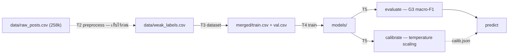

# Thai Twitter Text Classification

Classifier ข้อความทวิตเตอร์ภาษาไทยเป็น **19 หมวด (single-label — 18 หมวดเนื้อหา + `no_match`)** พร้อม confidence โดย fine-tune จาก weak label (tag rule) ทั้งหมด — ไม่ใช้ LLM และไม่มีชุดมนุษย์ label

## Table of Contents

- [Overview](#overview)
- [Features](#features)
- [Project Structure](#project-structure)
- [Prerequisites](#prerequisites)
- [Installation](#installation)
- [Development](#development)
  - [Pipeline stages](#pipeline-stages)
  - [Monitoring](#monitoring)
  - [Tests](#tests)
- [Related docs](#related-docs)

## Overview

โปรเจกต์นี้เทรน classifier ภาษาไทยจาก weak label ที่ได้จาก tag rule โดยตรง — pipeline เริ่มจาก `weak_labels.csv` แล้ว clean text, map taxonomy (weak 16 → 19 หมวด), stratified split แล้ว fine-tune WangchanBERTa ตามด้วย temperature scaling เพื่อปรับค่า confidence (ไม่ตัดสิน label)

ทางเลือกเทคโนโลยีหลัก: Python + [uv](https://docs.astral.sh/uv/) · PyTorch + Hugging Face `transformers` (v5) · โมเดล `airesearch/wangchanberta-base-att-spm-uncased` (default — เปลี่ยนเป็น PhayaThaiBERT ได้ที่ `--model`) · TensorBoard สำหรับ monitoring


```mermaid
graph LR
    WL["data/weak_labels.csv"] -->|"T3 dataset"| SPLIT["merged/train.csv + val.csv"]
    SPLIT -->|"T4 train"| M["models/"]
    M -->|"T5"| G3["evaluate — G3 macro-F1"]
    M -->|"T5"| CAL["calibrate — temperature scaling"]
    G3 --> P["predict"]
    CAL -.->|"calib.json"| P
    RAW["data/raw_posts.csv (258k)"] -.->|"T2 preprocess — เก็บไว้ก่อน"| WL
```

Gate เดียวที่เหลือคือ **G3** — ประเมิน macro-F1 บน `val` ที่ hold-out จาก weak (วัด agreement กับ weak rule — ไม่ใช่ความจริงสัมบูรณ์)

## Features

- Fine-tune WangchanBERTa เป็น classifier 19 หมวด (single-label) จาก weak label โดยตรง
- Clean + map taxonomy + stratified split + class weight ในคำสั่งเดียว (T3)
- Predict batch CLI รับทั้ง `.csv` และ `.xlsx` — interactive (เลือก model/sheet/คอลัมน์ + preview) หรือเงียบด้วย `--text-column`
- ปรับ confidence ด้วย temperature scaling (`calib.json`) — ไม่ตัดสิน label
- Monitor การเทรนผ่าน `metrics.json` ต่อ epoch + TensorBoard
- ประเมิน macro-F1 ด้วย gate G3 บน val hold-out (T5)

## Project Structure

```text
textcls/
├── src/textcls/        # source (src-layout) — ไฟล์ละหนึ่งสเตจ
│   ├── config.py       # ทุก path รวมที่เดียว
│   ├── preprocess.py   # T2 clean ภาษาไทย (ยังไม่ใช้ — เก็บไว้ก่อน)
│   ├── dataset.py      # T3 clean + map weak→19 + stratified split + class weight
│   ├── train.py        # T4 fine-tune
│   ├── infer.py        # shared: โหลดโมเดล + predict logits
│   ├── evaluate.py     # T5 G3 macro-F1
│   ├── calibrate.py    # T5 temperature scaling
│   └── predict.py      # T6 predict batch CLI (csv/xlsx + interactive)
├── configs/            # weak_label_map.json — mapping weak→หมวด 19 (มนุษย์แก้ได้)
├── data/               # (gitignored) ข้อมูลจริง + outputs
├── models/             # (gitignored) checkpoints
├── docs/               # specs/ · plans/ · notes/ · ideas/ · interviews/
├── notebooks/          # งานสำรวจ
├── scripts/            # ยูทิล
└── tests/              # pytest
```

## Prerequisites

**Software**

- Python ≥ 3.12 จัดการด้วย [uv](https://docs.astral.sh/uv/) เสมอ (ไม่ใช้ pip/conda เอง)
- TensorBoard — ดูกราฟการเทรน (มาพร้อม deps ผ่าน `uv sync`)

**Hardware**

- GPU (CUDA) สำหรับ T4 train — สเตจอื่นรันบนเครื่องทั่วไปได้

**Data**

ไฟล์ข้อมูลถูก gitignored — ต้องเตรียมเองก่อนรัน:

- `data/weak_labels.csv` — weak label จริง (คอลัมน์ `content, flag, category, …`)
- `data/categories.json` — นิยาม 19 หมวด
- `configs/weak_label_map.json` — mapping weak taxonomy → หมวด (มนุษย์แก้ได้)

แผนผังคอลัมน์ทุกไฟล์ดูที่ [`docs/notes/data-contract.md`](./docs/notes/data-contract.md)

## Installation

1. ติดตั้ง dependencies และตรวจว่า test ผ่าน:

```bash
# ติดตั้ง dependencies ทั้งหมดตาม uv.lock
uv sync

# รัน test suite (42 tests) เพื่อยืนยันการติดตั้ง
uv run pytest
```

2. เตรียมไฟล์ข้อมูลตามหมวด [Data](#data) ด้านบน

## Development

### Pipeline stages

รัน pipeline ทีละสเตจ (T3 → T4 → T5 → T6) — ทุกคำสั่งรันจาก root ของ repo:

```bash
# T3 — clean text + map weak 16 → 19 หมวด + stratified split + class weight
uv run python -m textcls.dataset \
  --weak data/weak_labels.csv \
  --categories data/categories.json \
  --out data/                          # → data/{merged,train,val}.csv + class_weights.json

# T4 — fine-tune (ต้องใช้ GPU) — output ที่ models/<tag>/
uv run python -m textcls.train \
  --train data/train.csv --val data/val.csv \
  --categories data/categories.json --out models/
```

Options หลักของ T4: `--model` (HF model id, default WangchanBERTa) · `--tag` (ชื่อโฟลเดอร์ checkpoint, default `model`) · `--epochs` (3) · `--lr` (2e-5) · `--batch-size` (16) · `--seed` (42) · `--logging-steps` (50)

```bash
# T5 — ประเมิน macro-F1 บน val (G3) และ fit temperature scaling
uv run python -m textcls.evaluate --model models/model/ --test data/val.csv
uv run python -m textcls.calibrate --model models/model/ --val data/val.csv   # เขียน calib.json

# T6 — predict แบบ pipeline (non-interactive): ระบุคอลัมน์ข้อความเอง
uv run python -m textcls.predict \
  --model models/model/ --input in.csv --output out.csv --text-column content

# T6 — แบบ interactive: เลือก model + sheet/คอลัมน์ใน terminal, preview, progress bar
uv run python -m textcls.predict --input in.xlsx
```

พฤติกรรม T6 ที่ควรรู้:

- ไม่ระบุ `--text-column` = **interactive** — เลือก model (จาก `models/`) + sheet/คอลัมน์, preview 5 แถว + ยืนยันก่อนรัน, bar chart กระจาย label ตอนจบ
- ไม่ระบุ `--output` → เขียนที่ `<input>_predicted.<ext>` (ต้นฉบับไม่ถูกแก้)
- แถวที่ข้อความว่าง → `category`/`confidence` เว้นว่าง · output เพิ่มคอลัมน์ `category` + `confidence`
- score ผ่าน temperature scaling จาก `calib.json` **เสมอ** (ไม่มีไฟล์ → T=1.0)
- ไฟล์ไม่มี header (`--no-header`) → คอลัมน์ชื่อ `col_1..col_N` และ output ก็ไม่มี header

### Monitoring

```bash
# เปิด TensorBoard ดู loss/learning_rate ทุก --logging-steps
uv run tensorboard --logdir models/model/runs
```

- `models/<tag>/metrics.json` — eval loss + macro-F1 ต่อ epoch (คิดแบบเดียวกับ G3: เฉพาะคลาสที่มีใน val) ผ่าน `MetricsCallback`

> [!NOTE]
> Smoke test ครบ chain บน GPU แล้ว: train 736 แถว (`models/model/`) → calibrate (T≈0.22) → evaluate (macro-F1 ≈ 0.48) → predict — **ยังไม่เทรนเต็ม 128k แถว**

### Tests

```bash
# รัน test suite ทั้งหมด — รันก่อน commit ทุกครั้ง
uv run pytest
```

42 tests — ครอบคลุม config, preprocess, dataset, train (mock tokenizer), evaluate, calibrate, predict · เน้น unit test ไม่โหลดโมเดลจริง/ไม่เรียก API

## Related docs

- [docs/specs/text-classification-pipeline.md](./docs/specs/text-classification-pipeline.md) — spec ดีไซน์ pipeline เต็ม
- [docs/plans/implementation-plan.md](./docs/plans/implementation-plan.md) — แผน implementation ราย task
- [docs/notes/data-contract.md](./docs/notes/data-contract.md) — โครงสร้างคอลัมน์ทุกไฟล์ (input/output แต่ละสเตจ)
- [docs/ideas/text-classification-pipeline.md](./docs/ideas/text-classification-pipeline.md) — แนวคิดต้นทาง
- [docs/interviews/text-classification-options-summary.md](./docs/interviews/text-classification-options-summary.md) — สรุปทางเลือกจากการ interview
- [CLAUDE.md](./CLAUDE.md) — คำแนะนำสำหรับทำงานในโปรเจกต์นี้ + สถานะปัจจุบัน

> [!WARNING]
> ข้อจำกัดปัจจุบัน: G3 วัด agreement กับ weak rule (ถ้า rule ผิด ตัวเลขก็ผิดตาม) · 3 หมวด (`religion`, `child_sexual_content`, `no_match`) ยังไม่มี weak source → ไม่มี train data · mapping weak→หมวด ยังใช้ default (รอ confirm)
